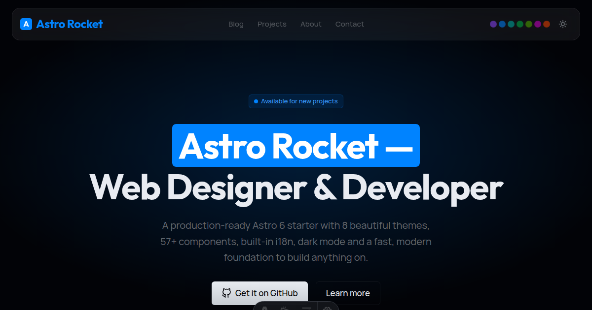

Astro Rocket ships configured with sensible defaults. This post documents every meaningful option you can change — what it does, where to find it, and what value to set.



## The main config file

Almost everything lives in `src/config/site.config.ts`. Open it and you'll see the full `siteConfig` object. The fields you're most likely to change:

```ts
name: 'Your Site Name',          // Logo, titles, footer copyright
description: 'Short description', // Default meta description
url: 'https://yoursite.com',     // Canonical URLs and sitemap
author: 'Your Name',
email: 'hello@yoursite.com',
```

The `name` field is not cosmetic only — it feeds into structured data, Open Graph tags, and the auto-generated favicon. Set it accurately from the start.

## Boolean switches

### Blog image overlay

```ts
// src/config/site.config.ts
blogImageOverlay: true,
```

When `true`, a translucent brand-colour tint is applied over blog cover images. This helps images blend with your theme if they have neutral or mismatched colours. Set it to `false` if your images are already on-brand or if you prefer photographs to appear unaltered.

### Dark mode default

The default mode is set directly in the HTML element in `src/layouts/BaseLayout.astro`:

```html
<html lang="en" class="scroll-smooth dark" data-theme="lime">
```

The `dark` class is what activates dark mode on first load. Remove it to default to light:

```html
<html lang="en" class="scroll-smooth" data-theme="lime">
```

The user's preference during their session is stored in `sessionStorage` — so it persists while the tab is open but resets when they open a new tab. This is intentional for a portfolio or marketing site. If you want it to persist across sessions, swap the `sessionStorage` calls for `localStorage` in the same file.

## Colour themes

Astro Rocket ships with eight colour themes. To change the active theme, edit `data-theme` in `src/layouts/BaseLayout.astro`:

```html
data-theme="lime"
```

Available values:

| Value | Personality |
|-------|-------------|
| `lime` | Sharp yellow-green — the default |
| `orange` | International Orange — bold and warm |
| `amber` | Muted gold |
| `green` | Balanced mid-green |
| `teal` | Blue-green |
| `blue` | Classic blue |
| `purple` | Rich violet |
| `magenta` | Vivid pink-purple |

The site's ThemeSelector component (shown in the header when `showThemeSelector` is enabled) lets visitors pick their own theme. Their choice is saved to `localStorage` and persists across sessions.

### Customising a theme's brand colour

Every theme is a CSS file in `src/styles/themes/`. Each file defines the full set of colour tokens for both light and dark mode using OKLCH values. Open the relevant file and adjust the `--brand-*` scale:

```css
html[data-theme="orange"] {
  --brand-500: oklch(62.5% 0.22 38); /* your primary colour */
  ...
}
```

The hue value (the last number) is all you need to change to shift the entire brand palette. Use [oklch.com](https://oklch.com) to pick visually.

## Header: floating capsule vs. fixed bar

Astro Rocket has two header shapes. The landing and marketing layouts use a floating capsule:

```astro
<Header shape="floating" variant="transparent" colorScheme="invert" position="fixed" />
```

The blog and standard page layouts use a full-width bar:

```astro
<Header position="fixed" size="lg" />
```

### Switching the blog header to a floating style

Open `src/layouts/BlogLayout.astro` and find the `<Header>` line. Change it to:

```astro
<Header shape="floating" variant="transparent" position="fixed" />
```

### Switching any page header from floating to a bar

Find the Header component in the relevant layout file and remove `shape="floating"`:

```astro
<!-- Before -->
<Header shape="floating" variant="transparent" position="fixed" />

<!-- After -->
<Header position="fixed" size="lg" />
```

### Header prop reference

All Header props and what they do:

| Prop | Options | Default | What it controls |
|------|---------|---------|-----------------|
| `position` | `fixed` `sticky` `static` | `fixed` | Whether the header stays at the top while scrolling |
| `shape` | `bar` `floating` | `bar` | Full-width bar or centred floating capsule |
| `size` | `sm` `md` `lg` | `md` | Header height |
| `variant` | `default` `solid` `transparent` | `default` | Background fill |
| `colorScheme` | `default` `invert` | `default` | Use inverted colours — for dark hero backgrounds |
| `layout` | `default` `centered` `minimal` | `default` | Logo and nav arrangement |
| `showThemeToggle` | `true` `false` | `true` | Dark/light mode toggle button |
| `showThemeSelector` | `true` `false` | `false` | Colour theme swatch picker |
| `showCta` | `true` `false` | `true` | CTA button in the header |
| `showMobileMenu` | `true` `false` | `true` | Hamburger menu on small screens |
| `showActiveState` | `true` `false` | `true` | Highlight for the current page link |

Set any prop on the `<Header>` component in the layout file for the page type you want to adjust.

## Footer

### Changing the copyright text

The footer copyright line reads from the `copyright` prop. Passing a custom value overrides it:

```astro
<Footer copyright="© {year} Your Name. All rights reserved." />
```

The `{year}` and `{siteName}` placeholders are replaced automatically at build time. Without a `copyright` prop it falls back to the site name from `site.config.ts`.

The Footer is used in three layout files:

| Layout file | Pages it covers |
|-------------|----------------|
| `src/layouts/PageLayout.astro` | Blog index, about, contact, any standard page |
| `src/layouts/BlogLayout.astro` | Individual blog posts |
| `src/layouts/MarketingLayout.astro` | The landing page |

Edit the `<Footer>` line in whichever file covers the pages you want to change.

### Footer layout options

```astro
<Footer layout="simple" />     <!-- Single row: logo, nav, social, copyright -->
<Footer layout="stacked" />    <!-- Vertically stacked sections -->
<Footer layout="columns" />    <!-- Multi-column link groups -->
<Footer layout="minimal" />    <!-- Copyright line only -->
```

### Other footer props

| Prop | Type | What it controls |
|------|------|-----------------|
| `showSocial` | `boolean` | Social media icons |
| `showCopyright` | `boolean` | Copyright line |
| `hideLogo` | `boolean` | Footer logo |
| `tagline` | `string` | Tagline under the logo |
| `background` | `default` `secondary` `invert` | Footer background colour |

## Navigation

Edit `src/config/nav.config.ts` to change the header and footer navigation in one place:

```ts
export const navItems: NavItem[] = [
  { label: 'Blog',    href: '/blog',    order: 1 },
  { label: 'About',   href: '/about',   order: 2 },
  { label: 'Contact', href: '/contact', order: 3 },
];
```

Add, remove, or reorder items freely. Both the header and footer read from this array.

## Analytics and verification

Set these in your `.env` file (copy from `.env.example`):

```bash
# Analytics
PUBLIC_GA_MEASUREMENT_ID=G-XXXXXXXXXX   # Google Analytics 4
PUBLIC_GTM_ID=GTM-XXXXXXX               # Google Tag Manager

# Cookie consent
PUBLIC_CONSENT_ENABLED=true             # Show cookie consent banner
PUBLIC_PRIVACY_POLICY_URL=/privacy      # Link in the consent banner

# Search console verification
GOOGLE_SITE_VERIFICATION=your-code
BING_SITE_VERIFICATION=your-code
```

None of these are required during development. The analytics components simply render nothing if the IDs are absent.

## Social links

Social links in the footer come from the `socialLinks` array in `src/config/site.config.ts`:

```ts
socialLinks: [
  { platform: 'github',   url: 'https://github.com/yourname' },
  { platform: 'twitter',  url: 'https://twitter.com/yourhandle' },
  { platform: 'linkedin', url: 'https://linkedin.com/in/yourname' },
],
```

Remove any platform you don't use. The footer won't render an empty social section.

## Quick reference

| What | Where | Key |
|------|-------|-----|
| Site name, author, email | `src/config/site.config.ts` | `name`, `author`, `email` |
| Blog image colour overlay | `src/config/site.config.ts` | `blogImageOverlay: true/false` |
| Navigation items | `src/config/nav.config.ts` | `navItems` array |
| Default colour theme | `src/layouts/BaseLayout.astro` | `data-theme="lime"` |
| Default dark/light mode | `src/layouts/BaseLayout.astro` | `class="dark"` on `<html>` |
| Header shape, position | `src/layouts/*.astro` | `shape`, `position` props |
| Header toggles | `src/layouts/*.astro` | `showThemeToggle`, `showCta`, etc. |
| Footer copyright text | `src/layouts/*.astro` | `copyright` prop |
| Footer layout | `src/layouts/*.astro` | `layout` prop |
| Analytics IDs | `.env` | `PUBLIC_GA_MEASUREMENT_ID` etc. |
| Social links | `src/config/site.config.ts` | `socialLinks` array |
| Brand colour (advanced) | `src/styles/themes/*.css` | `--brand-500` OKLCH value |

If Astro Rocket saved you time, a [star on GitHub](https://github.com/hansmartens68/astro-rocket) helps other developers find it. Takes two seconds.
